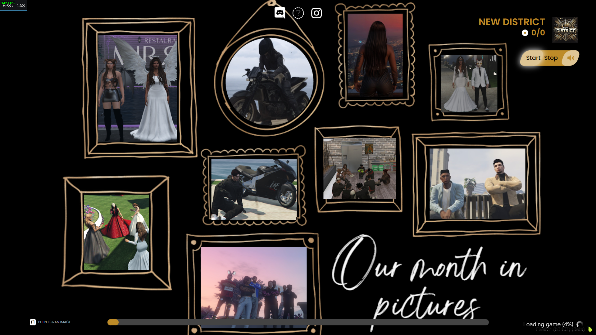

# 🎬 ND_loadingScreen


---

## 🖼️ Aperçu



---

## 📝 Description

**FR :**  
ND_loadingScreen est un écran de chargement simple, personnalisable et esthétique pour votre serveur FiveM.  
Il permet de configurer la couleur principale, une musique de fond, vos liens sociaux et une touche pour masquer l’interface.

**EN :**  
ND_loadingScreen is a simple, customizable, and aesthetic loading screen for your FiveM server.  
It allows you to set the main color, background music, social links, and a key to hide the overlay.

---

## ⚙️ Installation

1. Glissez le dossier `ND_loadingScreen` dans votre dossier `resources`.  
2. Ajoutez cette ligne dans votre `server.cfg` :
   ```cfg
   ensure ND_loadingScreen
   ```

---

## 🛠️ Configuration

Tout se configure dans le fichier :

```bash
assets/scripts/config.js
```

---

## 📜 Licence

Ce projet est sous licence **MIT**.  
This project is licensed under the **MIT License**.

> Voir le fichier [LICENSE](LICENSE) pour plus d’informations.

---

## 📬 Contact

**Pour toute question, bug ou suggestion :**  
> Discord → `vkstriick971`
